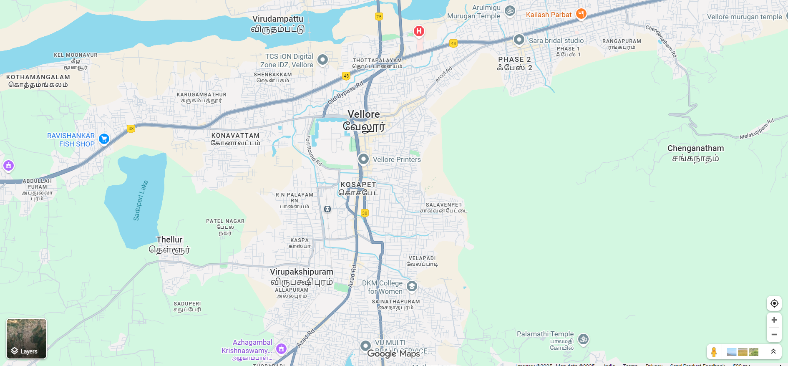
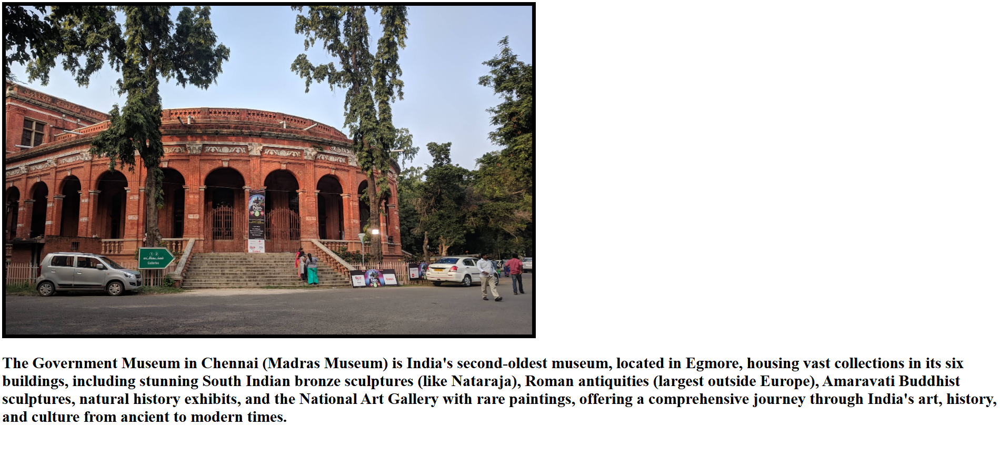

# Ex04 Places Around Me
# Date: 24-11-2025
# AIM
To develop a website to display details about the places around my house.

# DESIGN STEPS
## STEP 1
Create a Django admin interface.

## STEP 2
Download your city map from Google.

## STEP 3
Using <map> tag name the map.

## STEP 4
Create clickable regions in the image using <area> tag.

## STEP 5
Write HTML programs for all the regions identified.

## STEP 6
Execute the programs and publish them.

# CODE
```
<html>
<head>
    <title>My City</title>
</head>
<body>

<h1 align="center">
    <font color="red"><b>VELLORE</b></font>
</h1>

<h3 align="center">
    <font color="blue"><b>SANTHOSH REDDY K (25011965)</b></font>
</h3>

<center>
    

    <map name="MyCity">
        <area shape="rect" coords="50,50,500,700" href="home.html" title="My Home Town">
    </map>
</center>

</body>
</html>

```
# OUTPUT   





# RESULT
The program for implementing image maps using HTML is executed successfully.
